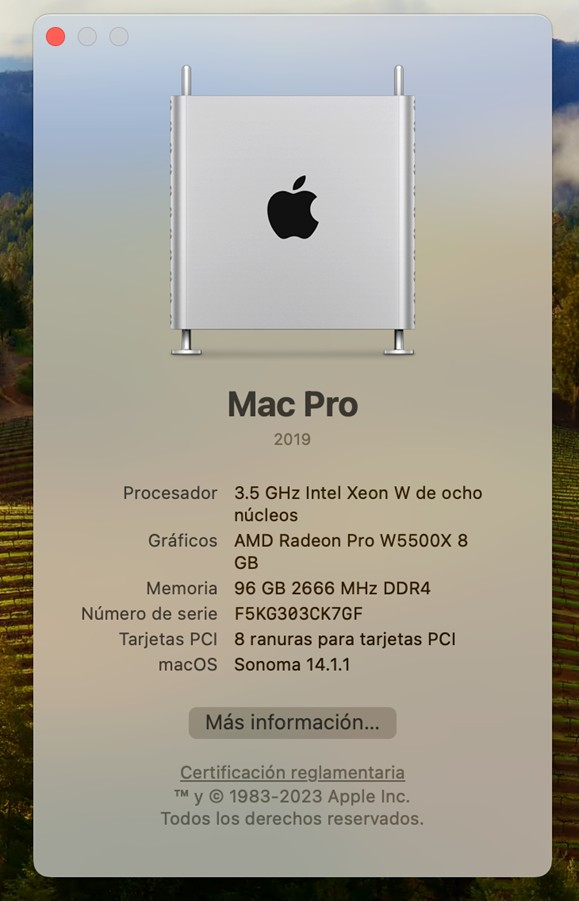
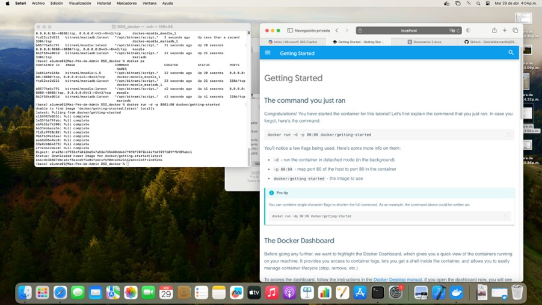
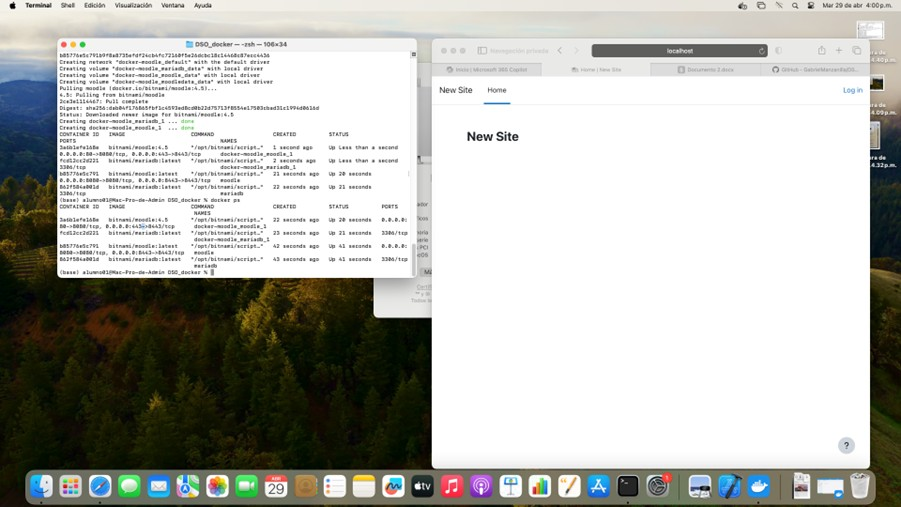
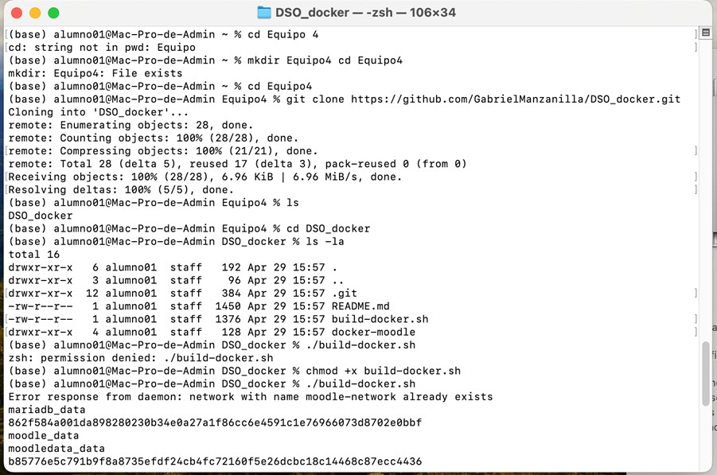
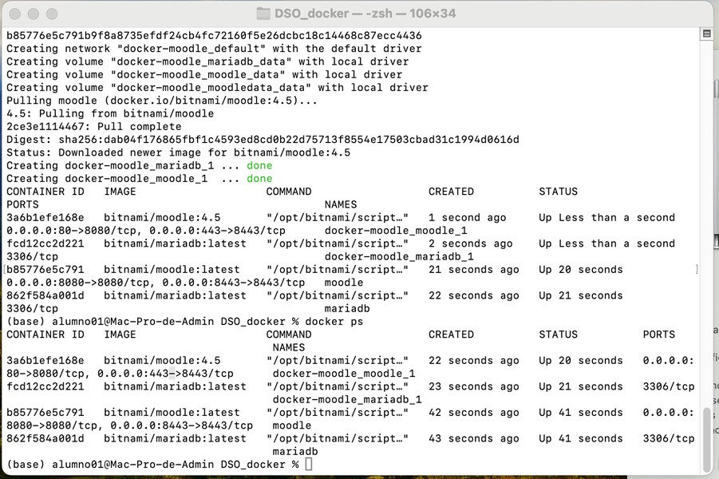
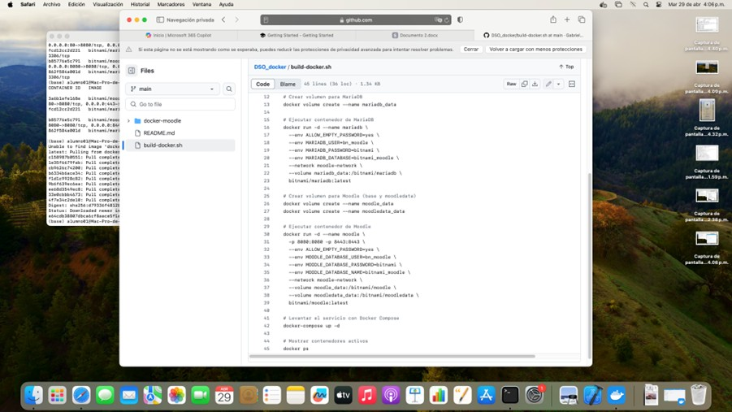

# Visualizacion de Recursos de la MAC

Primero Visualizamos los elementos que componen la mac y para ello damos click en _"Acerca de esta MAC"_
Y obtenemos los sig resultados:}

|  | ## Preguntas 1. **¿Qué modelo de Mac?**     - Mac Pro 2019 2. **¿Cuánta memoria RAM tiene?**     - 96 GB 2666 MHz DDR4 3. **¿Qué procesador tiene?**     - 3.5 GHz Intel Xeon W 4. **¿Cuántos núcleos tiene?**     - 8 núcleos 5. **¿Cuántos hilos de ejecución tiene?**     - **16 hilos** (El Intel Xeon W de 8 núcleos en este modelo soporta hyper-threading, lo que duplica la cantidad de hilos respecto a núcleos físicos). 6. **¿Qué tarjeta(s) de video tiene?**     - AMD Radeon Pro W5500X con 8 GB de memoria. # Correr Tutorial de Docker |
| --------------------------- | --------------------------------------------------------------------------------------------------------------------------------------------------------------------------------------------------------------------------------------------------------------------------------------------------------------------------------------------------------------------------------------------------------------------------------------------------------------------------------------------------------------------------------------------------------------------------------------------- |

Corremos el comando
~~~
docker run -d -p 8081:80 docker/getting-started
~~~

**Nota:** Nosotros usamos el puerto 8081 para que no cree interferencia al correr el moodle por el puerto que este en uso.

**Evidencia de resultados:**

**Descripción:** En la imagen se puede notar la ejecución del comando para la creación del contenedor en la terminal y en el lado derecho tenemos la vista que se crea al abrir  [http://localhost:8081](http://localhost:8081) 
# Desplegar un Sistema LMS Moodle usando Docker 
En este repositorio se cuenta con un script para poder instalar de manera automática el contenedor con el Moodle, para ejecutarlo solo sigue el siguiente comando:
~~~
chmod +x build-docker.sh
./build-docker.sh
~~~

El primer comando permite cambiar a modo ejecucion el script, y el segundo lo ejecuta directamente.

**Nota:** Este script automatiza la instalación, aunque si uno gusta realizar los pasos manualmente se explican en el [[DespliegueMAC#Apendice]]

**Evidencia de resultados:**

En las siguientes imágenes se muestra la interacción con la terminal que se llevo a cabo

|  |  |
| ---------------------- | ---------------------- |

# Apendice

| El repositorio contiene un script con los siguientes pasos lo que permite la automatizacion de la instalacion y ejecucion del contenedor |  |
| ---------------------------------------------------------------------------------------------------------------------------------------- | ---------------------- |

## Creación de la carpeta 
~~~
mkdir docker-moodle && cd docker-moodle 
~~~
---
## Clonado del repositorio a docker-compose
~~~
curl -sSL 
https://raw.githubusercontent.com/bitnami/containers/main/bitnami/moodle/docker
compose.yml > docker-compose.yml  
~~~

## Creacion de la red (network)
---

~~~
docker network create moodle-network 
~~~

## Creacion del volumen
---
### Creacion del volumen de mariadb
~~~
docker volume create --name mariadb_data 
docker run -d --name mariadb \ --env ALLOW_EMPTY_PASSWORD=yes \ --env MARIADB_USER=bn_moodle \ --env MARIADB_PASSWORD=bitnami \ --env MARIADB_DATABASE=bitnami_moodle \ --network moodle-network \ --volume mariadb_data:/bitnami/mariadb \ 
bitnami/mariadb:latest 
~~~

### Creacion del columen del moodle
~~~
docker volume create --name moodle_data 
docker run -d --name moodle \ -p 8080:8080 -p 8443:8443 \ --env ALLOW_EMPTY_PASSWORD=yes \ --env MOODLE_DATABASE_USER=bn_moodle \ --env MOODLE_DATABASE_PASSWORD=bitnami \ --env MOODLE_DATABASE_NAME=bitnami_moodle \ --network moodle-network \ --volume moodle_data:/bitnami/moodle \ --volume moodledata_data:/bitnami/moodledata \ 
bitnami/moodle:latest
~~~

## Levantar el servicio
---
~~~
docker-compose up -d
~~~

# Control de docker
~~~
docker ps
~~~
